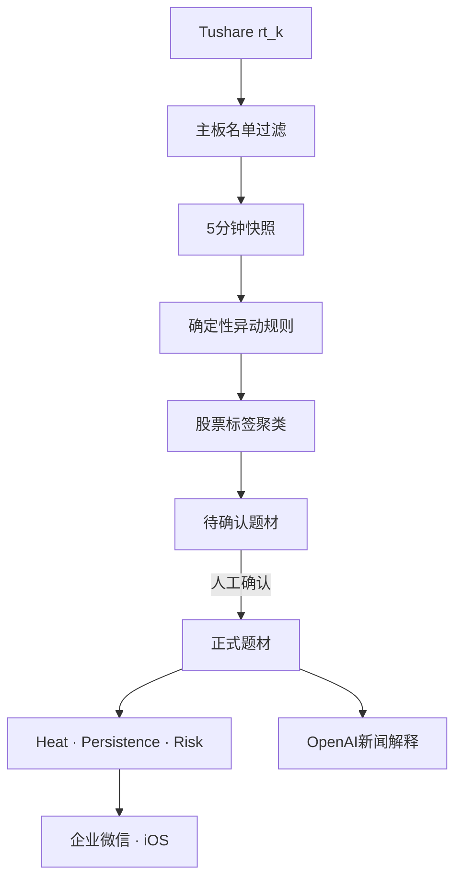

# StockTopic

资金共识驱动的A股题材生命周期系统。第一版仅覆盖沪深主板，采用 **Market First, News Second**：先从全市场异动股票发现共性，再用新闻解释和验证题材。

> 本项目是研究与监控工具，不构成投资建议，也不会自动交易。

## MVP已实现

- Tushare `rt_k` 每5分钟扫描沪深主板，按 `stock_basic` 主板名单过滤ST和退市整理股票。
- 交易日历和交易时段双重门禁；日历未知时默认停止，不按工作日猜测。
- 开盘集合竞价、上午、下午三个窗口采集；午休、收盘后、周末及休市日不调用实时行情。
- 平衡异动模式：涨停、炸板、快速放量拉升等硬事件直接进入；普通股票至少满足两项条件。
- 基于确定性股票标签聚类候选题材；机器决定成员，OpenAI只负责命名、合并建议和新闻解释。
- 使用5000积分可用的开盘啦榜单与题材成分补充涨停原因、连板状态、炸板和题材标签；接口失败时自动退回行业标签。
- 候选题材立即显示股票和原因；人工确认前数据库和API均不生成评分。
- 独立计算 Theme Heat、Theme Persistence、Entry Risk，并识别生命周期与龙头—板块背离。
- 企业微信高价值机会、高风险和数据故障推送，含数据库级去重。
- Mac mini `launchd` 常驻、自检、日志、每日备份、旧快照压缩归档。
- Apple风格响应式Web App，支持会话登录、手机底部导航、题材确认/合并/拆分和添加到主屏幕。
- SwiftUI iOS客户端骨架。

## 数据链路



## Mac mini安装

要求：macOS、Python 3.11或更高版本、Tushare Token及已购买的 `rt_k` 权限。

```bash
git clone https://github.com/Chris958/stocktopic.git
cd stocktopic
./scripts/install_macos.sh
```

安装程序会在本机提示输入Tushare、OpenAI及企业微信凭据，生成个人App API Token，并注册 `com.chris958.stocktopic` LaunchAgent。真实凭据只保存在权限为600的 `.env`，不会写入仓库。

安装完成后：

```bash
./scripts/doctor.sh
open http://127.0.0.1:8765
```

公网过渡版使用 `https://stock.bnken.com`，通过Cloudflare Tunnel转发到
`http://127.0.0.1:8765`。首次打开使用`.env`中的管理用户名和密码登录；凭据仅保存在
当前浏览器会话。iPhone Safari可通过“分享 → 添加到主屏幕”作为独立Web App使用。

停用服务但保留全部数据：

```bash
./scripts/uninstall_macos.sh
```

## 实时采集门禁

系统统一使用 `Asia/Shanghai`：

| 窗口 | `rt_k` |
|---|---:|
| 09:15–09:25 开盘集合竞价 | 每5分钟 |
| 09:25–09:30 | 停止 |
| 09:30–11:30 | 每5分钟 |
| 11:30–13:00 | 停止 |
| 13:00–15:00 | 每5分钟 |
| 15:00后、周末、休市日 | 停止 |

15:05后的收盘校准是单次日线任务，不调用 `rt_k`。管理页面在休市时只读取最后落库结果。

## 安全与降级

- 行情覆盖不足2000只时，本周期不生成异动和机会信号。
- 连续全市场累计成交额、成交量均未变化时判定数据异常，熔断机会信号并推送故障。
- OpenAI失败不影响行情采集；候选题材继续使用共享标签作为临时名称。
- 企业微信失败会记录在预警表中，不阻塞采集。
- 每次采集使用唯一交易日/时间槽，重启不会重复写入。
- 所有评分均带置信度和已知数据限制；历史分钟能力从上线日起累积。

## 开发与测试

```bash
python3 -m venv .venv
.venv/bin/pip install -e '.[dev]'
.venv/bin/ruff check .
.venv/bin/pytest -q
```

详细规则见 [MVP规格](docs/MVP_SPEC.md)、[评分说明](docs/SCORING.md)、[运维手册](docs/OPERATIONS.md) 和 [stock.bnken.com接入](docs/CLOUDFLARE.md)。
