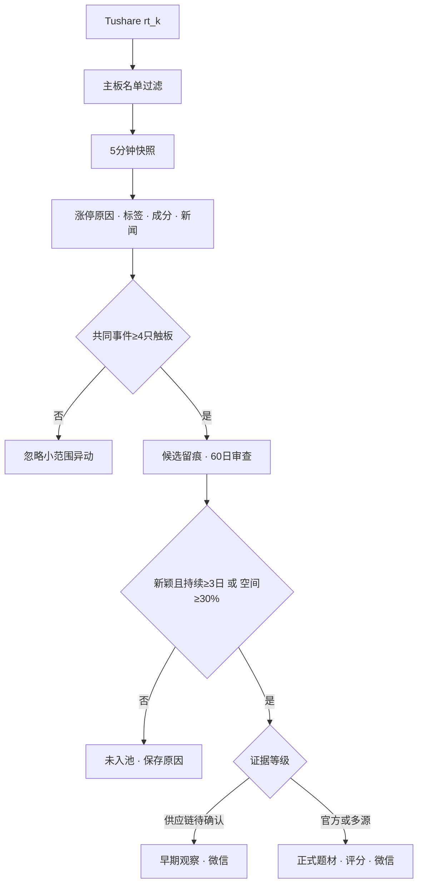

# StockTopic

资金共识驱动的A股新重点题材识别系统。当前仅覆盖沪深主板，采用 **Event First, Evidence Staged**：先确认同一具体事件逻辑至少4只股票当日曾触及涨停，再用60个交易日历史、持续性与证据等级决定进入早期观察或正式题材。

> 本项目是研究与监控工具，不构成投资建议，也不会自动交易。

## 当前已实现

- Tushare `rt_k` 每5分钟扫描沪深主板，按 `stock_basic` 主板名单过滤ST和退市整理股票。
- 交易日历和交易时段双重门禁；日历未知时默认停止，不按工作日猜测。
- 开盘集合竞价、上午、下午三个窗口采集；午休、收盘后、周末及休市日不调用实时行情。
- 普通个股异动只作为内部结构和评分数据，不在网页展示，也不能触发题材分析。
- 每次服务启动和收盘后自动回补最近2个交易日；停机、升级期间形成的四票候选不会因错过实时任务而漏报，且回补绝不调用 `rt_k`。
- 同一具体事件逻辑至少4只股票当日曾触及涨停才触发；炸板计入，未达门槛的小范围异动直接忽略。
- 综合涨停原因、开盘啦标签、题材成分与新闻催化做语义聚类，不要求股票标签文字完全一致。
- AI检索最近催化和60个交易日历史，必须同时通过新颖性、催化可信度，以及“预估持续至少3日或龙头候选情景空间至少30%”门槛。
- AI只能从高置信题材成员白名单提出扩展股票，系统再次验证标签证据后才自动加入；`kpl_concept_cons` 按概念ID/概念名与股票代码/股票名的官方字段语义落库。
- 使用5000积分可用的开盘啦榜单与题材成分补充涨停原因、连板状态、炸板和题材标签；接口失败时自动退回行业标签。
- 市场共识、新颖性和持续性通过但产业链证据尚未完全确认时，进入“早期观察”并推送；有官方信息或多源产业证据后升级“正式题材”。
- 每个达到四票门槛的候选都保留聚类证据、AI审查结论和未入池原因；页面可筛选早期观察、审查中与未入池，不再静默丢弃。
- 独立计算 Theme Heat、Theme Persistence、Entry Risk，并识别生命周期与龙头—板块背离。
- 企业微信推送新重点题材、高价值机会、高风险和数据故障，记录具体errcode与送达状态。
- Mac mini `launchd` 常驻、自检、日志、每日备份、旧快照压缩归档。
- Apple风格响应式Web App，支持会话登录、题材置顶、可恢复归档、股票/新闻折叠和添加到主屏幕。
- 题材内股票按当前涨幅纵向排序，显示当前/确认后累计涨幅、流通市值、近期连板、首次封板、封板顺序和30分钟带动数。
- 交易日盘前、盘中及盘后定时更新新闻催化，形成带来源、时间、证据等级和催化类型的历史列表。
- SwiftUI iOS客户端骨架。

## 数据链路



## Mac mini安装

要求：macOS、Python 3.11或更高版本、Tushare Token及已购买的 `rt_k` 权限。

```bash
git clone https://github.com/Chris958/stocktopic.git
cd stocktopic
./scripts/install_macos.sh
```

安装程序会在本机提示输入Tushare、OpenAI及企业微信凭据，生成个人App API Token，并注册 `com.chris958.stocktopic` LaunchAgent。真实凭据只保存在权限为600的 `.env`，不会写入仓库。

如果OpenAI Key来自兼容服务商，安装时把Base URL填写为服务商提供的API根地址，通常形如
`https://provider.example/v1`。系统会自动请求其 `/responses` 端点；也允许直接填写完整的
`https://provider.example/v1/responses`。该服务必须支持Responses API和 `web_search` 工具，
否则AI准入与新闻催化均无法执行，候选不会绕过门槛自动进入题材库。

安装完成后：

```bash
./scripts/doctor.sh
open http://127.0.0.1:8765
```

以后重新配置OpenAI或企业微信，不需要删除 `.env`，运行：

```bash
./scripts/configure_integrations.sh
```

公网过渡版使用 `https://stock.bnken.com`，通过Cloudflare Tunnel转发到
`http://127.0.0.1:8765`。首次打开使用`.env`中的管理用户名和密码登录；凭据仅保存在
当前浏览器会话。iPhone Safari可通过“分享 → 添加到主屏幕”作为独立Web App使用。

首次安装若发生在收市后，系统不会绕过交易时段调用 `rt_k`，因此要到下一个交易窗口才会产生首批分钟行情。个股异动不再出现在网页中。

停用服务但保留全部数据：

```bash
./scripts/uninstall_macos.sh
```

## 实时采集门禁

系统统一使用 `Asia/Shanghai`：

| 窗口 | `rt_k` |
|---|---:|
| 09:15–09:25 开盘集合竞价 | 每5分钟 |
| 09:25–09:30 | 停止 |
| 09:30–11:30 | 每5分钟 |
| 11:30–13:00 | 停止 |
| 13:00–15:00 | 每5分钟 |
| 15:00后、周末、休市日 | 停止 |

15:05后的收盘校准是单次日线任务，不调用 `rt_k`。管理页面在休市时只读取最后落库结果。

## 新重点题材准入与分级

1. 当日累计至少4只股票共同指向一个具体新增事件逻辑并曾触及涨停，当前炸板仍计入；
2. 共同事件由涨停原因、开盘啦标签、题材成分和近期新闻共同验证，宽泛的“AI、化工、并购”不能单独成组；
3. 与最近60个交易日的历史发酵、近义名称及成员重合比较；
4. AI新颖性置信度至少70、催化可信度至少65，并至少有一条带原始URL的来源；
5. 预估持续至少3个交易日，或龙头候选的有条件情景空间至少30%；
6. 通过上述门槛但只有单一供应链/研报证据时进入早期观察；有官方信息或至少两个独立域名的多源产业证据后进入正式题材；
7. 扩展股票必须命中开盘啦题材成分高置信白名单，AI不能自行创造股票代码。

## 安全与降级

- 连续交易阶段有效行情覆盖不足2000只时，本周期不生成机会信号并推送数据故障。
- 集合竞价 `close=0` 视为“暂无有效价格”，不会计算成-100%；升级时自动清理旧污染记录。
- 连续全市场累计成交额、成交量均未变化时判定数据异常，熔断机会信号并推送故障。
- OpenAI失败不影响行情采集；语义聚类短暂退回共同标签并明确标注降级，30分钟后重试，候选不会绕过AI准入。
- 企业微信失败会记录取Token/发送消息阶段、errcode和建议，不阻塞采集。
- 每次采集使用唯一交易日/时间槽，重启不会重复写入。
- 所有评分均带置信度和已知数据限制；历史分钟能力从上线日起累积。

## 开发与测试

```bash
python3 -m venv .venv
.venv/bin/pip install -e '.[dev]'
.venv/bin/ruff check .
.venv/bin/pytest -q
```

详细规则见 [MVP规格](docs/MVP_SPEC.md)、[评分说明](docs/SCORING.md)、[运维手册](docs/OPERATIONS.md) 和 [stock.bnken.com接入](docs/CLOUDFLARE.md)。
